# Fundamentals of Computers and Programming

## Table of Contents

1. [Introduction to Computer](#1-introduction-to-computer)
2. [Components of a Computer System](#2-components-of-a-computer-system)
3. [Computer Architecture](#3-computer-architecture)
4. [Definition of Software and Hardware](#4-definition-of-software-and-hardware)
5. [Types of Programming Languages](#5-types-of-programming-languages)
6. [Language Translators](#6-language-translators)
   - [6.1 Assembler](#61-assembler)
   - [6.2 Compiler](#62-compiler)
   - [6.3 Interpreter](#63-interpreter)
   - [6.4 Linker and Loader](#64-linker-and-loader)
7. [Algorithm](#7-algorithm)
   - [7.1 Definition of an Algorithm](#71-definition-of-an-algorithm)
   - [7.2 Characteristics of an Algorithm](#72-characteristics-of-an-algorithm)
   - [7.3 Complexity Notations](#73-complexity-notations)
8. [Flowchart](#8-flowchart)
   - [8.1 Definition of a Flowchart](#81-definition-of-a-flowchart)
   - [8.2 Symbols Used in Writing a Flowchart](#82-symbols-used-in-writing-a-flowchart)
9. [Writing Algorithms for Simple Problems](#9-writing-algorithms-for-simple-problems)
10. [Writing Flowcharts for Simple Problems](#10-writing-flowcharts-for-simple-problems)

---

## 1. Introduction to Computer

A **computer** is an electronic device that accepts data as input, processes it according to a set of instructions (a program), and produces meaningful information as output. It can store, retrieve, and process data at very high speed with accuracy.

### 1.1 Characteristics of a Computer

| Characteristic | Explanation |
|---|---|
| **Speed** | Performs millions of instructions per second. |
| **Accuracy** | Produces error-free results, provided correct input and instructions are given. |
| **Diligence** | Can perform repetitive tasks continuously without fatigue or loss of accuracy. |
| **Storage Capacity** | Can store huge volumes of data and instructions permanently or temporarily. |
| **Versatility** | Can perform a wide variety of tasks — calculations, data processing, multimedia, communication, etc. |
| **Automation** | Once a program is loaded, a computer can execute instructions with minimal human intervention. |

### 1.2 Basic Working Principle: Input → Process → Output (IPO Cycle)

Every computer, regardless of size or purpose, works on this fundamental cycle:

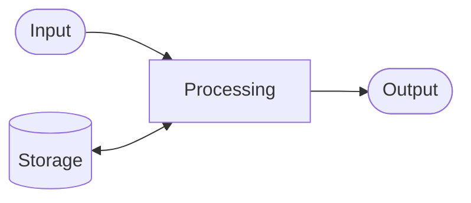

- **Input:** Data and instructions are fed into the computer using input devices (keyboard, mouse, scanner, etc.).
- **Processing:** The CPU processes the input data according to the given instructions.
- **Output:** The processed data (information) is presented to the user via output devices (monitor, printer, speaker, etc.).
- **Storage:** Data, instructions, and results may be stored for future use.

---

## 2. Components of a Computer System

A computer system is a combination of **hardware** and **software** that work together to perform tasks.

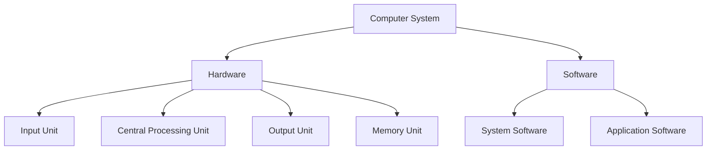

### 2.1 Input Unit
Accepts data and instructions from the outside world and converts them into machine-readable form.
- **Examples:** Keyboard, Mouse, Scanner, Microphone, Joystick.

### 2.2 Central Processing Unit (CPU)
The "brain" of the computer. It interprets and executes instructions. It has three main parts (discussed in detail in Section 3):
- **Control Unit (CU)**
- **Arithmetic Logic Unit (ALU)**
- **Registers**

### 2.3 Memory Unit
Stores data, instructions, and results.
- **Primary Memory:** RAM (volatile, temporary), ROM (non-volatile, permanent).
- **Secondary Memory:** Hard Disk, SSD, Pen Drive, CD/DVD — non-volatile, used for permanent storage.

### 2.4 Output Unit
Converts the processed (machine-readable) data back into a human-readable form.
- **Examples:** Monitor, Printer, Speaker, Plotter.

### 2.5 Software
The set of programs and instructions that tell the hardware what to do (discussed in detail in Section 4).

---

## 3. Computer Architecture

Computer architecture refers to the internal structure and organization of a computer system — how its functional components (CPU, memory, I/O) are arranged and how they communicate with each other.

Most modern computers are based on the **Von Neumann Architecture**, proposed by John von Neumann in 1945. Its key principle is that **both program instructions and data are stored in the same memory** and are fetched using the same bus.

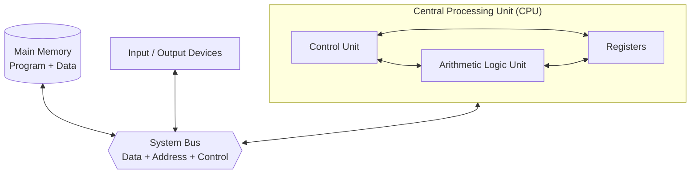

### 3.1 Key Functional Units

| Unit | Function |
|---|---|
| **Control Unit (CU)** | Directs the operation of the processor — fetches instructions from memory, decodes them, and coordinates the ALU, registers, memory, and I/O devices. |
| **Arithmetic Logic Unit (ALU)** | Performs all arithmetic operations (addition, subtraction, etc.) and logical operations (AND, OR, NOT, comparisons). |
| **Registers** | Small, extremely fast storage locations inside the CPU used to hold data/instructions temporarily during execution (e.g., Accumulator, Program Counter, Instruction Register). |
| **Main Memory** | Stores both the program instructions and the data being processed, in the same address space. |

### 3.2 System Bus

The bus is the communication pathway that connects the CPU, memory, and I/O devices.

- **Data Bus:** Carries the actual data being transferred.
- **Address Bus:** Carries the memory address that specifies where data should be read from or written to.
- **Control Bus:** Carries control signals (read/write, clock signals, interrupts) that coordinate all operations.

### 3.3 Fetch–Decode–Execute Cycle

The CPU executes every instruction using this repeating cycle:

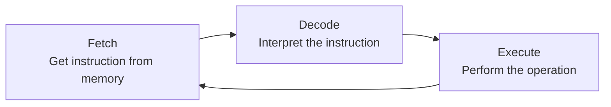

---

## 4. Definition of Software and Hardware

### 4.1 Hardware
**Hardware** refers to the physical, tangible components of a computer system that can be seen and touched — the electronic and mechanical parts.
> **Examples:** CPU, Monitor, Keyboard, Mouse, RAM, Hard Disk, Motherboard, Printer.

### 4.2 Software
**Software** refers to a set of instructions, programs, or data that tells the hardware what tasks to perform and how to perform them. It is intangible — it cannot be physically touched, only executed and observed as behavior.
> **Examples:** Operating Systems (Windows, Linux), Application programs (MS Word, Chrome), Programming language compilers.

### 4.3 Hardware vs Software

| Basis | Hardware | Software |
|---|---|---|
| **Nature** | Physical, tangible | Logical, intangible |
| **Development** | Manufactured in factories | Developed by programmers |
| **Change** | Difficult/expensive to modify once built | Easy to modify, update, or replace |
| **Dependency** | Can exist without software (but won't function usefully) | Cannot run without hardware |
| **Examples** | CPU, RAM, Keyboard | Operating System, MS Excel |

### 4.4 Types of Software (Overview)

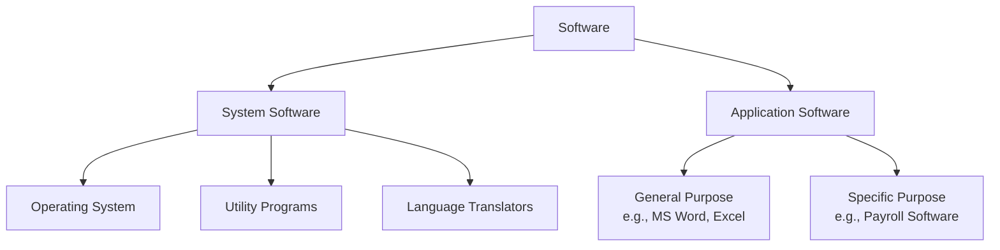

---

## 5. Types of Programming Languages

A **programming language** is a formal set of instructions used to communicate with a computer and write programs. Programming languages are broadly classified into three generations/levels:

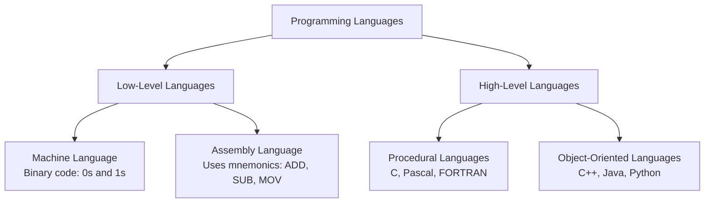

### 5.1 Machine Language
- The most basic language, consisting entirely of **binary digits (0s and 1s)**.
- Directly understood by the CPU — no translation needed.
- **Advantage:** Fastest execution.
- **Disadvantage:** Extremely difficult to write, read, and debug; hardware-dependent.

### 5.2 Assembly Language
- Uses short, human-readable **mnemonics** (e.g., `ADD`, `SUB`, `MOV`, `JMP`) instead of raw binary.
- Still closely tied to the specific computer's hardware (machine-dependent).
- Requires an **Assembler** to convert it into machine code.

### 5.3 High-Level Language
- Uses English-like statements (e.g., `a = b + c;`) that are easy for humans to read and write.
- **Machine-independent** — the same program can (largely) run on different types of computers.
- Requires a **Compiler** or **Interpreter** to convert it into machine code.
- **Examples:** C, C++, Java, Python, JavaScript.

### 5.4 Comparison

| Feature | Machine Language | Assembly Language | High-Level Language |
|---|---|---|---|
| **Form** | Binary (0/1) | Mnemonics | English-like statements |
| **Ease of writing** | Very difficult | Difficult | Easy |
| **Machine dependency** | Fully dependent | Fully dependent | Independent |
| **Execution speed** | Fastest | Fast | Slower (needs translation) |
| **Translator needed** | None | Assembler | Compiler/Interpreter |

---

## 6. Language Translators

Since computers understand only machine language (binary), programs written in assembly or high-level languages must be **translated** before execution. This is done by language translators/processors.

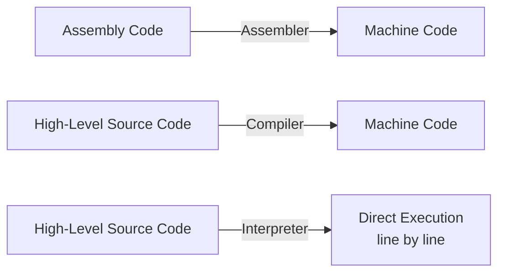

### 6.1 Assembler

An **assembler** is a translator that converts a program written in **assembly language** into **machine language (object code)**.

- Works on a one-to-one basis: each assembly mnemonic generally maps to one machine instruction.
- Output is called **object code**, which may still need linking before it can be executed.

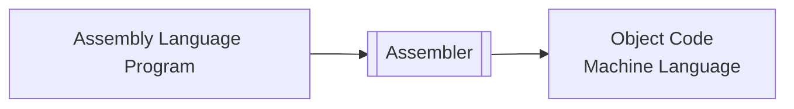

### 6.2 Compiler

A **compiler** is a translator that converts an **entire** high-level language program (source code) into machine language (object code) **all at once, before execution**.

**Key features:**
- Reads the whole program, checks for syntax errors, and generates a complete list of errors (if any) before producing output.
- Produces an **object file**, which is then linked to create an executable file.
- Execution is fast because translation happens only once, in advance.
- **Examples:** GCC (for C), javac (for Java).

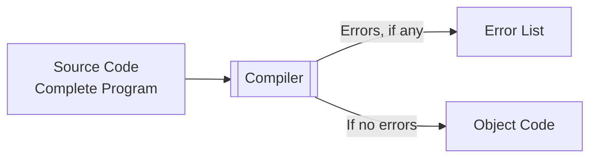

### 6.3 Interpreter

An **interpreter** is a translator that converts high-level source code into machine code **line by line**, executing each line immediately before moving to the next.

**Key features:**
- No separate object file is produced; translation and execution happen together.
- If an error occurs in a line, execution stops immediately at that point (errors are reported one at a time).
- Generally slower than compiled programs for repeated execution, since translation happens every time the program runs.
- **Examples:** Python interpreter, JavaScript engine (in browsers).

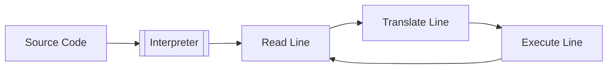

### 6.4 Compiler vs Interpreter

| Basis | Compiler | Interpreter |
|---|---|---|
| **Translation unit** | Entire program at once | One line/statement at a time |
| **Speed of execution** | Faster (pre-translated) | Slower (translated every run) |
| **Error reporting** | Reports all errors together, after full scan | Reports one error at a time; stops at first error |
| **Output** | Produces object/executable file | No separate object file produced |
| **Examples** | C, C++ compilers | Python, JavaScript |

### 6.5 Linker and Loader

**Linker:**
A **linker** is a utility that combines multiple object files (and any required library files) generated by the compiler/assembler into a **single executable file**. It resolves references between different modules/files (e.g., a function used in one file but defined in another, or built-in library functions).

**Loader:**
A **loader** is a part of the operating system that takes the executable file produced by the linker and **loads it into main memory (RAM)**, preparing it for execution by the CPU. It allocates memory space and sets up the necessary runtime environment.

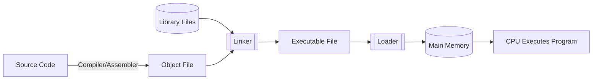

**Overall translation pipeline, start to finish:**

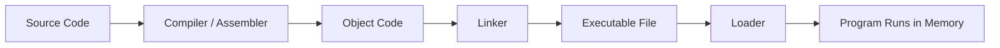

---

## 7. Algorithm

### 7.1 Definition of an Algorithm

An **algorithm** is a finite, well-defined, step-by-step sequence of instructions designed to perform a specific task or solve a particular problem. It takes some input, processes it through a defined set of steps, and produces the desired output.

> An algorithm is a solution to a problem expressed as a sequence of steps, independent of any particular programming language.

### 7.2 Characteristics of an Algorithm

Every valid algorithm must satisfy the following properties:

| Characteristic | Description |
|---|---|
| **Input** | Should take zero or more well-defined inputs. |
| **Output** | Must produce at least one well-defined output/result. |
| **Definiteness** | Every step must be clear, precise, and unambiguous. |
| **Finiteness** | Must terminate after a finite number of steps — it cannot run forever. |
| **Effectiveness** | Each step must be simple and basic enough to be carried out, in principle, by a person using pen and paper. |
| **Independence (Language-Independence)** | An algorithm is not tied to any specific programming language — it can be implemented in any language. |

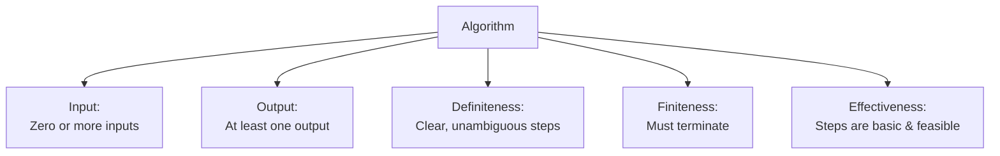

### 7.3 Complexity Notations

**Time complexity** measures how the running time of an algorithm grows as the input size (n) increases. It is expressed using **asymptotic notations**, which describe the algorithm's behavior for large input sizes, independent of hardware or implementation details.

#### (a) Big-O Notation — O(g(n)) — Worst Case / Upper Bound
Describes the **upper bound** of an algorithm's running time — the maximum time it could possibly take.
> f(n) = O(g(n)) means f(n) grows no faster than g(n), for sufficiently large n.

#### (b) Omega Notation — Ω(g(n)) — Best Case / Lower Bound
Describes the **lower bound** — the minimum time an algorithm will take.
> f(n) = Ω(g(n)) means f(n) grows at least as fast as g(n).

#### (c) Theta Notation — Θ(g(n)) — Average Case / Tight Bound
Describes a **tight bound** — when the upper and lower bounds are the same order, giving the exact growth rate.
> f(n) = Θ(g(n)) means f(n) grows exactly as fast as g(n), within constant factors.

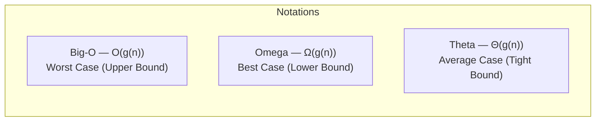

#### Common Time Complexities (fastest to slowest)

| Notation | Name | Example |
|---|---|---|
| O(1) | Constant | Accessing an array element by index |
| O(log n) | Logarithmic | Binary search |
| O(n) | Linear | Linear search, single loop |
| O(n log n) | Linearithmic | Merge sort, quick sort (average) |
| O(n²) | Quadratic | Nested loops, bubble sort |
| O(2ⁿ) | Exponential | Recursive Fibonacci (naive) |

---

## 8. Flowchart

### 8.1 Definition of a Flowchart

A **flowchart** is a diagrammatic (pictorial) representation of an algorithm, using standardized symbols connected by arrows to show the sequence of steps, decisions, and the flow of control needed to solve a problem. It provides a visual roadmap of the logic before actual coding begins.

### 8.2 Symbols Used in Writing a Flowchart

| Symbol Name | Shape | Purpose |
|---|---|---|
| **Terminal (Start/End)** | Oval / Rounded rectangle | Marks the beginning or end of the flowchart. |
| **Input/Output** | Parallelogram | Represents input (reading data) or output (displaying/printing results). |
| **Process** | Rectangle | Represents a processing step — a calculation or data manipulation. |
| **Decision** | Diamond (Rhombus) | Represents a decision point with two (or more) possible paths (Yes/No, True/False). |
| **Flow Line / Arrow** | Arrow | Shows the direction of flow/sequence of execution. |
| **Connector** | Small circle | Used to connect different parts of a flowchart, especially across pages. |
| **Predefined Process** | Rectangle with double vertical bars | Represents a call to a sub-routine or predefined process/function. |

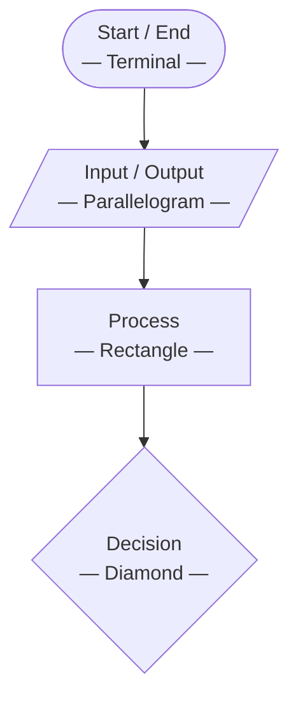

**Rules for drawing a flowchart:**
- Use standard symbols only (as above).
- Every flowchart must have exactly one **Start** and at least one **End** symbol.
- Flow lines should have arrowheads to clearly indicate direction (normally top to bottom, left to right).
- Keep the flow logical, clear, and avoid unnecessary crossing of lines.

---

## 9. Writing Algorithms for Simple Problems

### Example 1: Algorithm to Find the Sum of Two Numbers

```
Step 1: Start
Step 2: Read two numbers, A and B
Step 3: Compute SUM = A + B
Step 4: Print SUM
Step 5: Stop
```

### Example 2: Algorithm to Find the Largest of Three Numbers

```
Step 1: Start
Step 2: Read three numbers A, B, and C
Step 3: If A > B and A > C, then LARGEST = A
Step 4: Else if B > C, then LARGEST = B
Step 5: Else, LARGEST = C
Step 6: Print LARGEST
Step 7: Stop
```

### Example 3: Algorithm to Check Whether a Number is Prime

```
Step 1: Start
Step 2: Read a number N
Step 3: Set FLAG = 0 and I = 2
Step 4: Repeat while I < N:
         4.1: If N is divisible by I (N % I == 0), set FLAG = 1 and go to Step 5
         4.2: Increment I by 1
Step 5: If FLAG = 1, print "Not Prime"
         Else, print "Prime"
Step 6: Stop
```

---

## 10. Writing Flowcharts for Simple Problems

### 10.1 Flowchart: Sum of Two Numbers

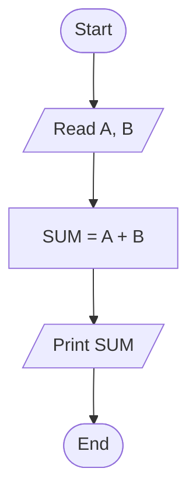

### 10.2 Flowchart: Largest of Three Numbers

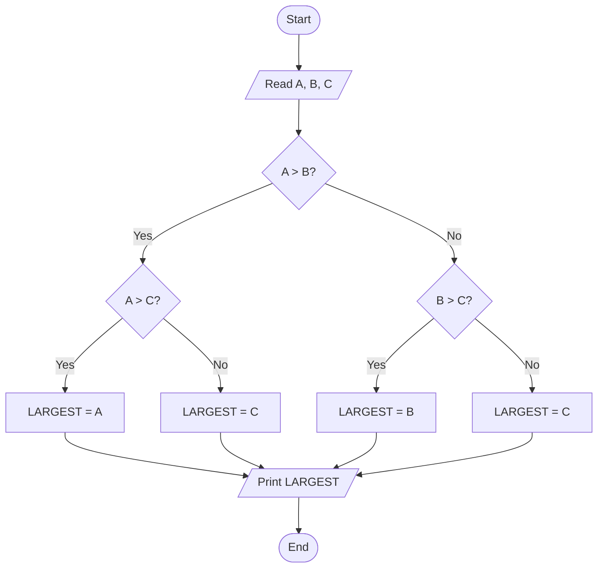

### 10.3 Flowchart: Check Whether a Number is Prime

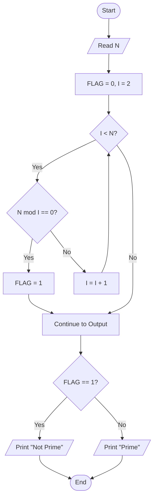

---
