# Programming in C

## Table of Contents

1. [Introduction to C](#1-introduction-to-c)
2. [Features of C](#2-features-of-c)
3. [Basic C Program Structure](#3-basic-c-program-structure)
4. [C Tokens](#4-c-tokens)
5. [Data Types](#5-data-types)
6. [C Operators](#6-c-operators)
7. [Operator Precedence](#7-operator-precedence)
8. [Implicit Type Conversion](#8-implicit-type-conversion)
9. [Explicit Type Conversion](#9-explicit-type-conversion)
10. [if Statement](#10-if-statement)
11. [if-else Statement](#11-if-else-statement)
12. [Nested if](#12-nested-if)
13. [switch-case Statement](#13-switch-case-statement)
14. [while Statement](#14-while-statement)
15. [do-while Statement](#15-do-while-statement)
16. [for Statement](#16-for-statement)
17. [break Statement](#17-break-statement)
18. [continue Statement](#18-continue-statement)

---

## 1. Introduction to C

**C** is a general-purpose, procedural, mid-level programming language developed by **Dennis Ritchie** at **Bell Laboratories** in **1972**. It was originally created to develop the UNIX operating system and has since become one of the most widely used and influential programming languages in computing history.

C is called a **mid-level language** because it combines the features of both:
- **Low-level languages** — direct access to memory via pointers, bit-level operations.
- **High-level languages** — readable syntax, portability, structured constructs (loops, functions).

> Almost every modern language — C++, Java, C#, Python — has borrowed syntax or concepts from C, which is why C is often taught as the foundational language in computer science.

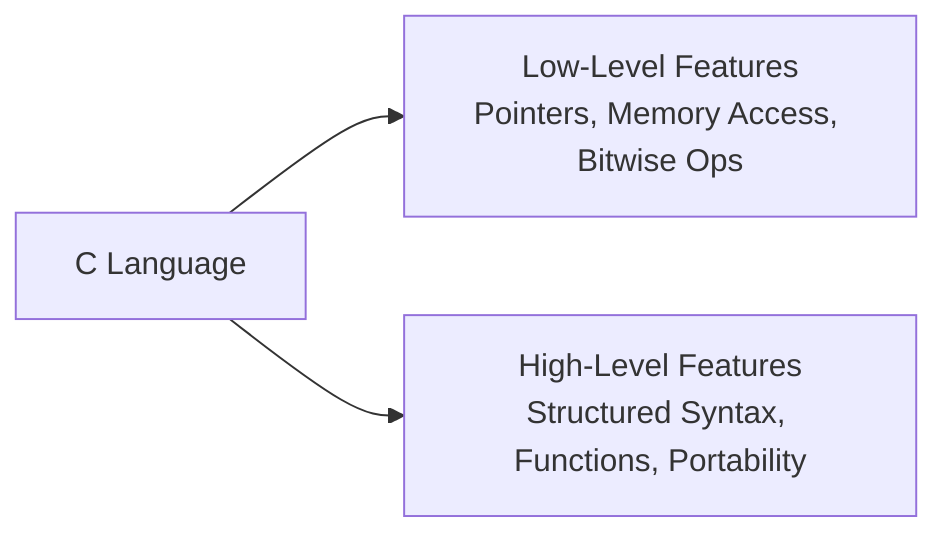

---

## 2. Features of C

| Feature | Explanation |
|---|---|
| **Simple & Structured** | Programs are divided into functions/blocks, making code organized and easy to understand. |
| **Mid-Level Language** | Combines low-level hardware access with high-level readability. |
| **Portability** | A C program written on one machine can run on another with little or no modification. |
| **Fast & Efficient** | Compiled directly to machine code, giving execution speed close to assembly language. |
| **Rich Library Support** | Provides a large set of built-in functions (`stdio.h`, `math.h`, `string.h`, etc.). |
| **Modularity** | Large programs can be broken into smaller, reusable **functions**. |
| **Pointers** | Direct memory manipulation is possible using pointers, giving fine control over memory. |
| **Extensibility** | New functions and features can easily be added to a C program. |
| **Dynamic Memory Management** | Supports runtime memory allocation using `malloc()`, `calloc()`, `free()`, etc. |
| **Case-Sensitive** | Treats uppercase and lowercase identifiers as different (`Sum` and `sum` are different). |

---

## 3. Basic C Program Structure

Every C program follows a well-defined structure, regardless of its size or purpose.

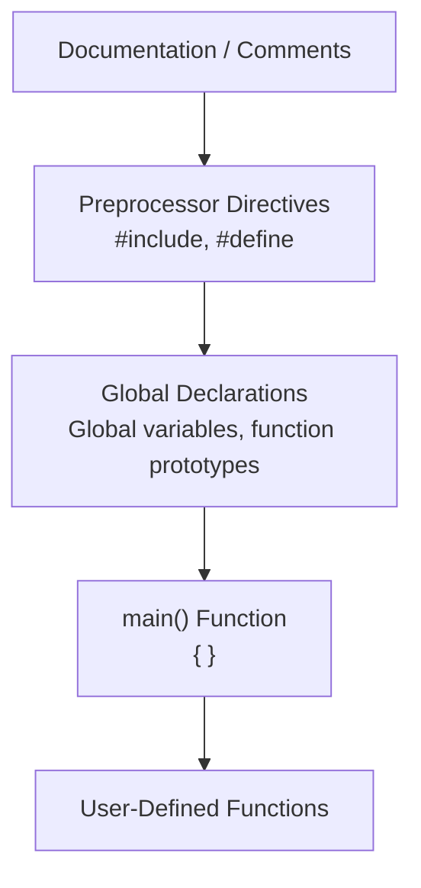

### Sample Program

```c
#include <stdio.h>      // Preprocessor directive - header file inclusion
#define PI 3.14         // Preprocessor directive - macro definition

int square(int n);      // Function prototype (declaration)

int main() {             // main function - entry point of execution
    int num = 5;
    int result = square(num);
    printf("Square of %d is %d\n", num, result);
    return 0;             // Indicates successful termination
}

int square(int n) {      // Function definition
    return n * n;
}
```

### Explanation of Each Section

| Section | Purpose |
|---|---|
| **Documentation/Comments** | `//` or `/* */` — used to describe the program; ignored by the compiler. |
| **Preprocessor Directives** | Instructions processed before compilation begins, e.g. `#include`, `#define`. |
| **Global Declarations** | Variables/function prototypes declared outside `main()`, accessible throughout the file. |
| **`main()` Function** | Every C program must have exactly one `main()` function — execution always starts here. |
| **User-Defined Functions** | Additional functions written by the programmer to modularize the program. |
| **`return 0;`** | Returns control to the operating system, signaling successful execution. |

---

## 4. C Tokens

A **token** is the smallest individual unit in a C program that is meaningful to the compiler. The compiler breaks the entire source code into tokens during compilation.

```mermaid
flowchart TB
    T[C Tokens] --> KW[Keywords<br/>int, if, while, return]
    T --> ID[Identifiers<br/>Variable/function names]
    T --> CO[Constants<br/>10, 3.14, 'A', "text"]
    T --> ST[String Literals<br/>"Hello World"]
    T --> OP[Operators<br/>+, -, *, /, =, ==]
    T --> SP[Special Symbols<br/>; , { } ( ) [ ]]
```

| Token Type | Description | Example |
|---|---|---|
| **Keywords** | Reserved words with predefined meaning; cannot be used as identifiers | `int`, `float`, `if`, `while`, `return` |
| **Identifiers** | Names given to variables, functions, arrays, etc. | `sum`, `total_marks`, `calculateArea` |
| **Constants** | Fixed values that do not change during execution | `100`, `3.14`, `'A'` |
| **String Literals** | Sequence of characters enclosed in double quotes | `"Hello, World!"` |
| **Operators** | Symbols that perform operations on operands | `+`, `-`, `*`, `=`, `==`, `&&` |
| **Special Symbols** | Punctuation used for syntax structure | `;` `,` `{ }` `( )` `[ ]` |

**Rules for Identifiers:**
- Must begin with a letter or underscore (`_`), not a digit.
- Can contain letters, digits, and underscores only.
- Cannot be a reserved keyword.
- Case-sensitive (`Total` ≠ `total`).

---

## 5. Data Types

A **data type** specifies the type of value a variable can hold and how much memory it occupies.

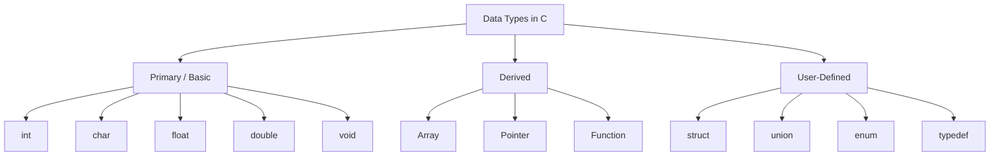

### Primary Data Types

| Data Type | Size (typical) | Description | Example Declaration |
|---|---|---|---|
| `int` | 2 or 4 bytes | Stores whole numbers (positive/negative) | `int age = 20;` |
| `float` | 4 bytes | Stores single-precision decimal numbers | `float price = 99.5;` |
| `double` | 8 bytes | Stores double-precision decimal numbers (higher accuracy) | `double pi = 3.14159;` |
| `char` | 1 byte | Stores a single character | `char grade = 'A';` |
| `void` | — | Represents "no value"; used for functions with no return value | `void display();` |

Qualifiers like `short`, `long`, `signed`, and `unsigned` can modify the range of these basic types (e.g., `unsigned int`, `long double`).

---

## 6. C Operators

An **operator** is a symbol that tells the compiler to perform a specific mathematical, relational, or logical operation on one or more operands.

```mermaid
flowchart TB
    OP[C Operators] --> AR[Arithmetic<br/>+ - * / %]
    OP --> RE[Relational<br/> > < >= <= == !=]
    OP --> LO[Logical<br/>&& || !]
    OP --> AS[Assignment<br/>= += -= *= /=]
    OP --> INC[Increment / Decrement<br/>++ --]
    OP --> BW[Bitwise<br/>& | ^ ~ << >>]
    OP --> CN[Conditional / Ternary<br/>? :]
```

| Category | Operators | Example |
|---|---|---|
| **Arithmetic** | `+  -  *  /  %` | `a + b`, `a % b` (modulus/remainder) |
| **Relational** | `>  <  >=  <=  ==  !=` | `a > b` returns 1 (true) or 0 (false) |
| **Logical** | `&& (AND)  \|\| (OR)  ! (NOT)` | `(a > 0) && (b > 0)` |
| **Assignment** | `=  +=  -=  *=  /=  %=` | `a += 5;` is same as `a = a + 5;` |
| **Increment/Decrement** | `++  --` | `a++` (post-increment), `++a` (pre-increment) |
| **Bitwise** | `&  \|  ^  ~  <<  >>` | `a & b`, `a << 2` (left shift) |
| **Conditional (Ternary)** | `? :` | `max = (a > b) ? a : b;` |
| **Special** | `sizeof, &, comma (,)` | `sizeof(int)` returns size in bytes |

---

## 7. Operator Precedence

When an expression contains multiple operators, **precedence** determines which operator is evaluated first, and **associativity** determines the order (left-to-right or right-to-left) when operators of the same precedence appear together.

### Precedence Table (Highest to Lowest)

| Precedence | Operator(s) | Description | Associativity |
|---|---|---|---|
| 1 (Highest) | `()` `[]` `->` `.` | Function call, array subscript, member access | Left to Right |
| 2 | `!` `~` `++` `--` `+`(unary) `-`(unary) `*`(deref) `&`(address) `sizeof` | Unary operators | Right to Left |
| 3 | `*` `/` `%` | Multiplication, Division, Modulus | Left to Right |
| 4 | `+` `-` | Addition, Subtraction | Left to Right |
| 5 | `<<` `>>` | Bitwise shift | Left to Right |
| 6 | `<` `<=` `>` `>=` | Relational | Left to Right |
| 7 | `==` `!=` | Equality | Left to Right |
| 8 | `&` | Bitwise AND | Left to Right |
| 9 | `^` | Bitwise XOR | Left to Right |
| 10 | `\|` | Bitwise OR | Left to Right |
| 11 | `&&` | Logical AND | Left to Right |
| 12 | `\|\|` | Logical OR | Left to Right |
| 13 | `?:` | Ternary/Conditional | Right to Left |
| 14 | `= += -= *= /=` | Assignment | Right to Left |
| 15 (Lowest) | `,` | Comma | Left to Right |

**Example:**
```c
int result = 10 + 5 * 2;   // Multiplication has higher precedence than addition
                            // Evaluates as: 10 + (5 * 2) = 20, not (10 + 5) * 2
```

---

## 8. Implicit Type Conversion

**Implicit type conversion** (also called **automatic type conversion** or **type coercion**) occurs automatically when the compiler converts one data type to another **without explicit instruction from the programmer** — typically to avoid data loss when different data types are mixed in an expression.

The compiler follows the **rule of automatic promotion to the "larger"/wider data type**:

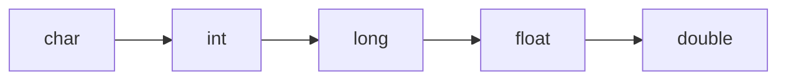

> When two operands of different types appear in an expression, the "smaller" type is automatically converted to the "larger" type before the operation is performed. This is also called **type promotion**.

**Example:**
```c
int a = 5;
float b = 2.5;
float result = a + b;   
// 'a' (int) is implicitly converted to float before addition
// result = 7.5
```

```c
int x = 10, y = 3;
float avg = x / y;      
// WARNING: x / y is INTEGER division first (result = 3), 
// THEN the int result 3 is converted to float 3.0
// avg = 3.0, NOT 3.33 — a classic implicit-conversion pitfall
```

---

## 9. Explicit Type Conversion

**Explicit type conversion** (also called **type casting**) occurs when the programmer **manually and deliberately** converts a variable from one data type to another using the **cast operator**.

**Syntax:**
```c
(data_type) expression;
```

**Example:**
```c
int x = 10, y = 3;
float avg = (float) x / y;   
// x is explicitly cast to float BEFORE division
// avg = 3.333333 (correct floating-point division)
```

```c
float f = 9.7;
int i = (int) f;   
// Explicit cast truncates the decimal part
// i = 9  (not rounded, simply truncated)
```

### Implicit vs Explicit Conversion

| Basis | Implicit Conversion | Explicit Conversion |
|---|---|---|
| **Performed by** | Compiler automatically | Programmer manually |
| **Syntax** | No special syntax needed | Uses cast operator `(type)` |
| **Control** | Less control; can cause unintended results | Full control over the conversion |
| **Also known as** | Type coercion / type promotion | Type casting |

---

## 10. if Statement

The **if statement** is the simplest decision-making (conditional) statement in C. It executes a block of code **only if** the given condition evaluates to true (non-zero).

**Syntax:**
```c
if (condition) {
    // statements executed only if condition is true
}
```

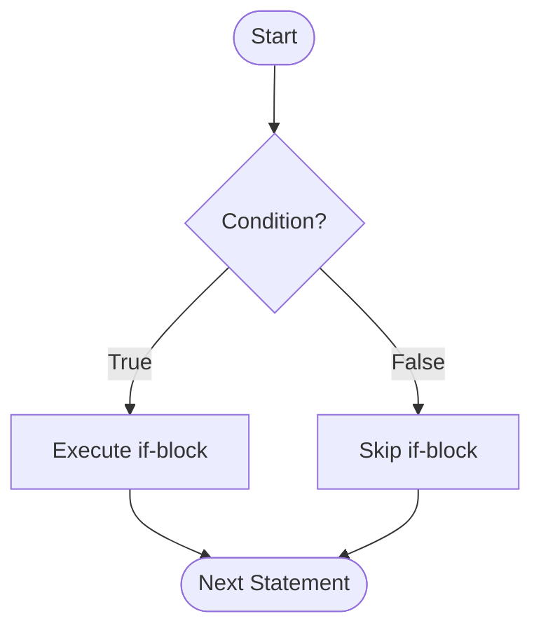

**Example:**
```c
int age = 20;
if (age >= 18) {
    printf("Eligible to vote\n");
}
```

---

## 11. if-else Statement

The **if-else statement** provides an alternative block of code to execute **when the condition is false**, ensuring exactly one of the two blocks always runs.

**Syntax:**
```c
if (condition) {
    // executed if condition is true
} else {
    // executed if condition is false
}
```

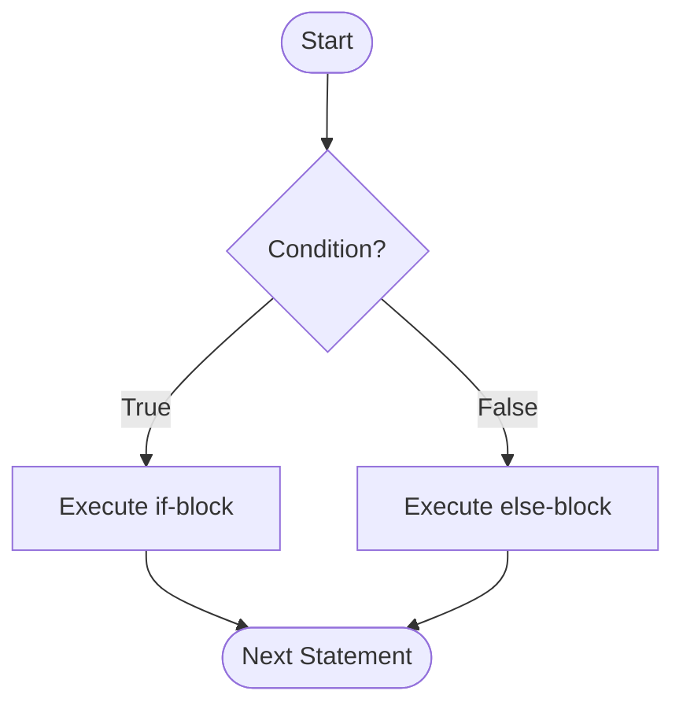

**Example:**
```c
int num = 7;
if (num % 2 == 0) {
    printf("Even number\n");
} else {
    printf("Odd number\n");
}
```

---

## 12. Nested if

A **nested if** occurs when an `if` or `if-else` statement is placed **inside** another `if` or `else` block. It is used when a decision depends on multiple, layered conditions. A common variant is the **if-else-if ladder**, used to test a series of conditions in sequence.

**Syntax:**
```c
if (condition1) {
    if (condition2) {
        // executed if both condition1 and condition2 are true
    } else {
        // executed if condition1 is true but condition2 is false
    }
} else {
    // executed if condition1 is false
}
```

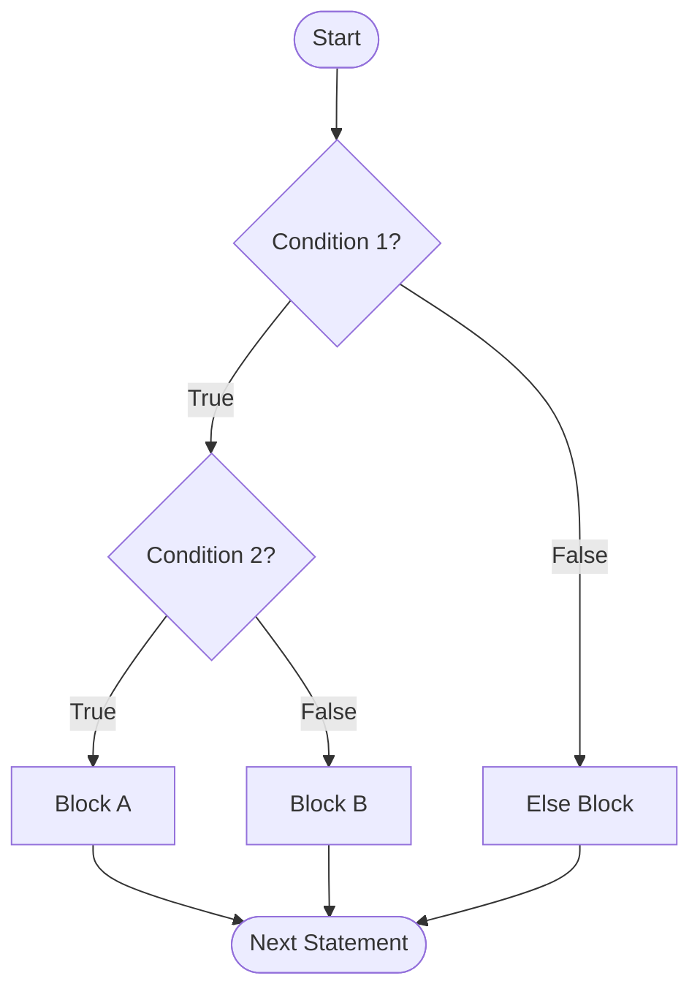

**Example — Grading using if-else-if ladder:**
```c
int marks = 75;
if (marks >= 90) {
    printf("Grade: A\n");
} else if (marks >= 75) {
    printf("Grade: B\n");
} else if (marks >= 60) {
    printf("Grade: C\n");
} else {
    printf("Grade: F\n");
}
```

---

## 13. switch-case Statement

The **switch-case statement** is a multi-way branching statement that compares a single variable/expression against a list of constant values (**cases**) and executes the matching block. It is often a cleaner alternative to a long if-else-if ladder when comparing one variable against many fixed values.

**Syntax:**
```c
switch (expression) {
    case value1:
        // statements
        break;
    case value2:
        // statements
        break;
    default:
        // statements executed if no case matches
}
```

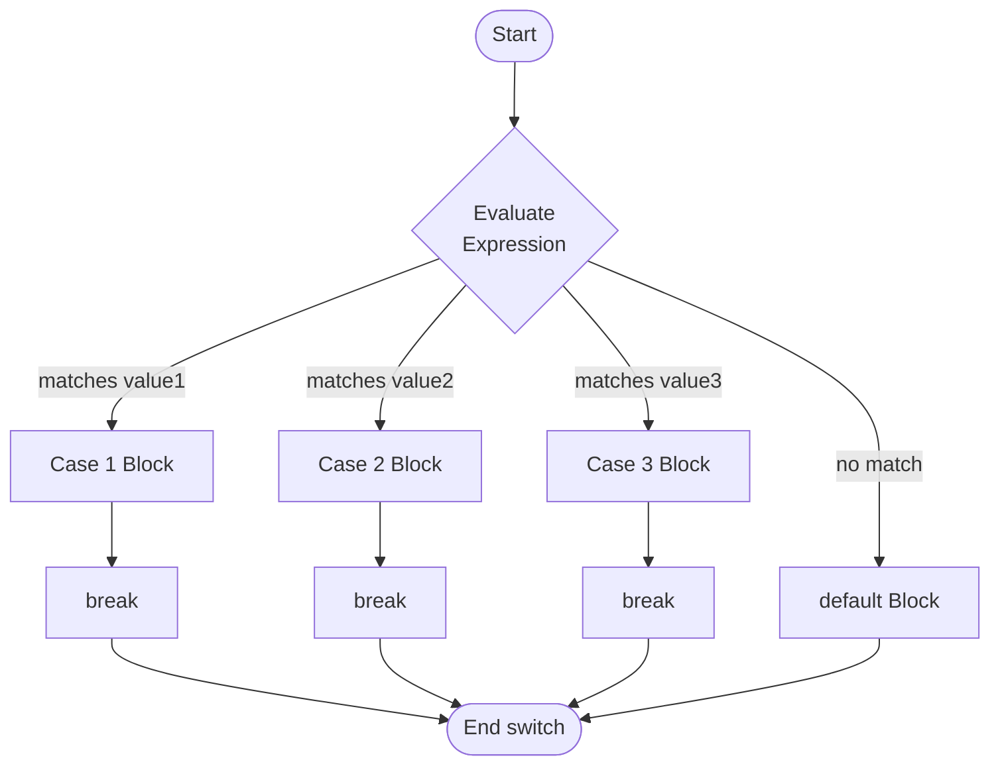

**Example:**
```c
int day = 3;
switch (day) {
    case 1: printf("Monday\n"); break;
    case 2: printf("Tuesday\n"); break;
    case 3: printf("Wednesday\n"); break;
    default: printf("Invalid day\n");
}
```

> **Important:** Without a `break` statement, execution "falls through" to the next case and continues executing subsequent case blocks until a `break` or the end of the switch is reached.

---

## 14. while Statement

The **while loop** is an **entry-controlled** loop — the condition is checked **before** each iteration. If the condition is false at the very first check, the loop body **never executes**.

**Syntax:**
```c
while (condition) {
    // loop body — repeated as long as condition is true
}
```

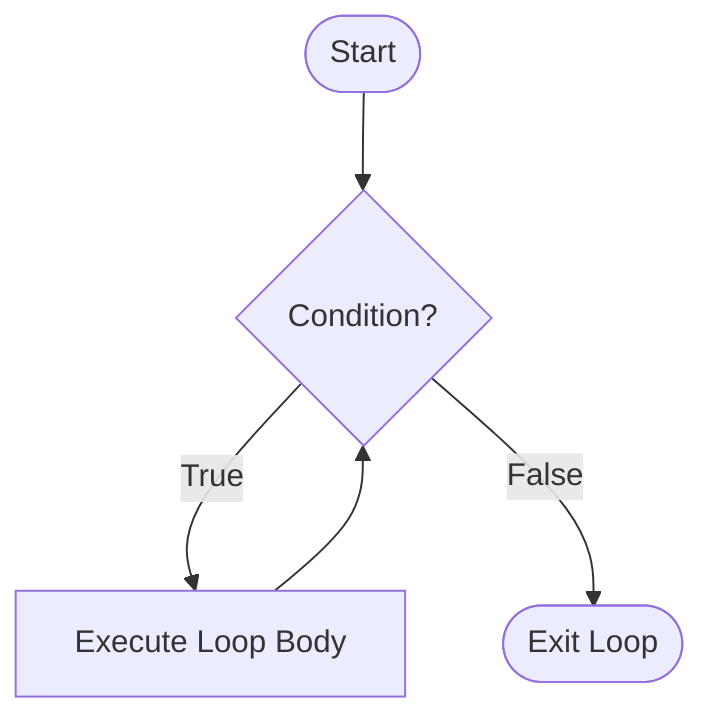

**Example:**
```c
int i = 1;
while (i <= 5) {
    printf("%d ", i);
    i++;
}
// Output: 1 2 3 4 5
```

---

## 15. do-while Statement

The **do-while loop** is an **exit-controlled** loop — the condition is checked **after** each iteration. This guarantees the loop body executes **at least once**, regardless of whether the condition is true or false.

**Syntax:**
```c
do {
    // loop body — executed at least once
} while (condition);
```

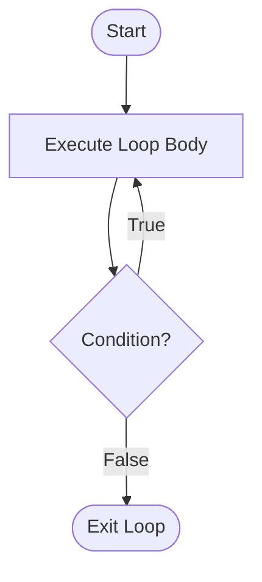

**Example:**
```c
int i = 1;
do {
    printf("%d ", i);
    i++;
} while (i <= 5);
// Output: 1 2 3 4 5 (same output, but body guaranteed to run once)
```

### while vs do-while

| Basis | while | do-while |
|---|---|---|
| **Condition checked** | Before executing the body (entry-controlled) | After executing the body (exit-controlled) |
| **Minimum executions** | 0 (may never execute) | 1 (always executes at least once) |
| **Syntax ending** | `while (condition) { }` | `do { } while (condition);` (note the semicolon) |

---

## 16. for Statement

The **for loop** is an entry-controlled loop that combines **initialization**, **condition testing**, and **increment/decrement** into a single, compact line — making it ideal when the number of iterations is known in advance.

**Syntax:**
```c
for (initialization; condition; update) {
    // loop body
}
```

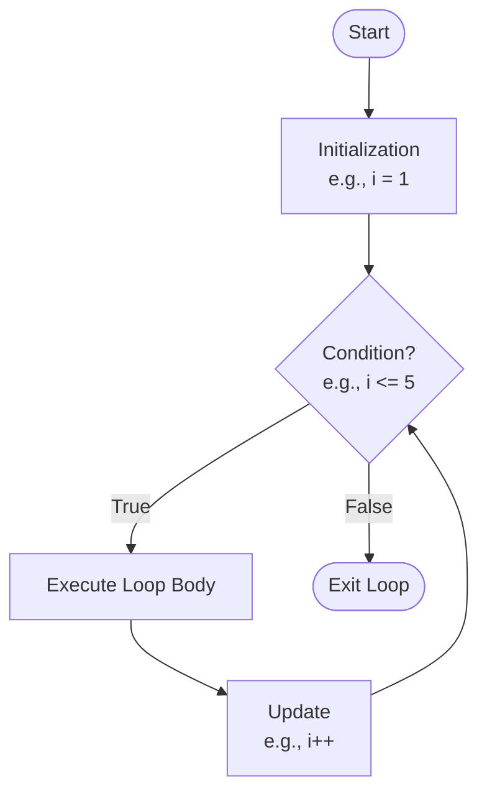

**Example:**
```c
for (int i = 1; i <= 5; i++) {
    printf("%d ", i);
}
// Output: 1 2 3 4 5
```

**Execution order:** Initialization (once) → Check Condition → Execute Body → Update → Check Condition again → … until condition is false.

---

## 17. break Statement

The **break statement** immediately **terminates** the nearest enclosing loop (`for`, `while`, `do-while`) or `switch` statement, and control jumps to the statement immediately following it.

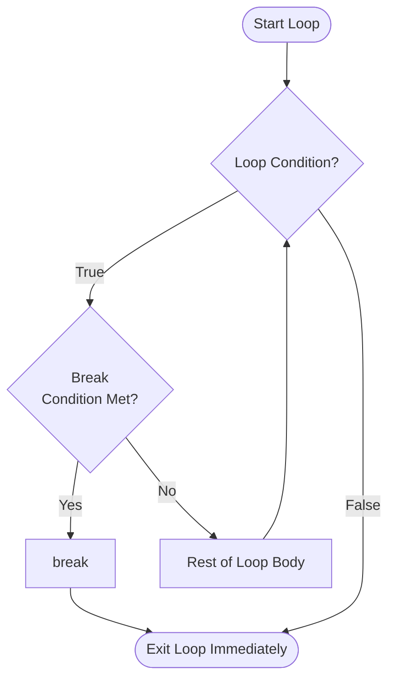

**Example:**
```c
for (int i = 1; i <= 10; i++) {
    if (i == 5) {
        break;      // loop terminates completely when i equals 5
    }
    printf("%d ", i);
}
// Output: 1 2 3 4
```

---

## 18. continue Statement

The **continue statement** skips the **remaining statements** in the current iteration of a loop and jumps directly to the next iteration (re-checking the condition for `while`/`do-while`, or moving to the update step for `for`). Unlike `break`, it does **not** terminate the loop.

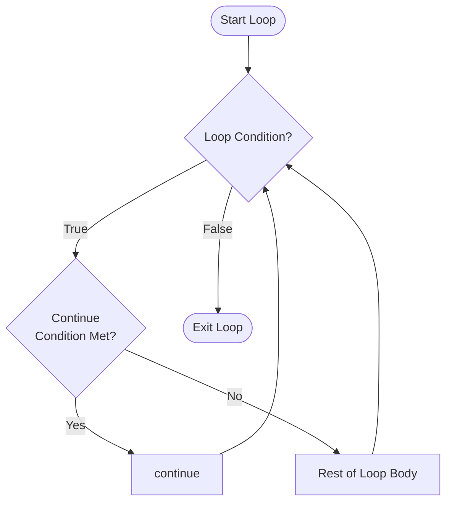

**Example:**
```c
for (int i = 1; i <= 5; i++) {
    if (i == 3) {
        continue;   // skips printf for i == 3, moves to next iteration
    }
    printf("%d ", i);
}
// Output: 1 2 4 5   (3 is skipped, loop continues to the end)
```

### break vs continue

| Basis | break | continue |
|---|---|---|
| **Effect** | Terminates the loop/switch entirely | Skips only the current iteration |
| **Control moves to** | The statement right after the loop | The next iteration of the loop |
| **Usable in** | Loops and `switch` | Loops only |

---